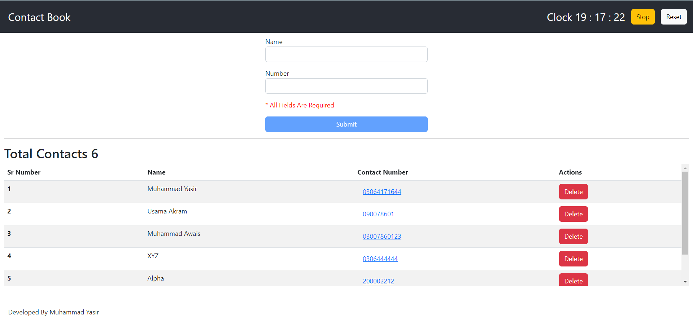

# SESSION - 4 (React Hooks)

This repo is the solution to the task assigned in Session - 4

## Task
Create a react app and use all hooks discussed

## Solution
A Contact Book App is build. Use of hooks and key features are described below.

1.  <b>useState</b> is used as
    - To manage new contact form's validation and input fields.
    - To manage list of contacts displayed.

2.  <b>useEffect</b> is used 
    - to set form validity state when any dependency(input) changes.
    - Change error text when form validity state updates.

3. <b>useContext</b>
    - A context 'ContactContext' is created.
    - Application is wrapped in above context.
    - In Components 'ContactContext' is used to retrieve list of contacts and functions.

4. <b>Custom Hook with useCallBack and useMemo</b>
    - a custom useContact hook is created that uses callBack and Memo hooks to create functions(push, pop) and state(list).
    - These functions and state are assigned to the 'ContactContext'.

5. <b>useRef and useReducer</b>
    - A clock is implemented with tick, stop and reset functionality
    - Since the state of clock(time) changes differently on tick, stop and reset therefore useReducer is used to manage state.
    - useRef is used to tick clock after every 1000 ms(1 sec)

Test output

